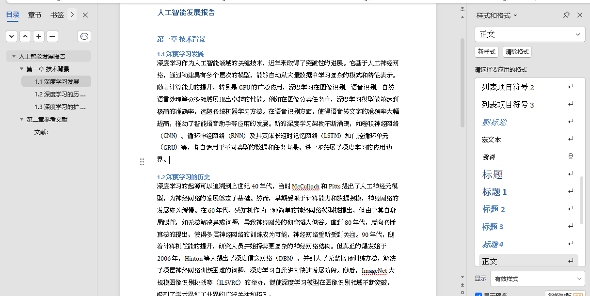

```markdown:
d:\py project\pythonProject\docxTemplate2docx\README.md
```
# 智能文档生成助手 🤖

[](https://www.python.org/)
[](https://opensource.org/licenses/MIT)

基于AI的Word文档自动化生成系统，支持模板驱动和自由创作双模式，快速生成专业级文档。

## ✨ 核心功能
- **双模式生成**  
  - **模板模式**：智能解析Word标题结构（<mcsymbol name="parse_template" filename="main.py" path="d:\py project\pythonProject\docxTemplate2docx\main.py" startline="8" type="function"></mcsymbol>）
  - **自由模式**：AI自由发挥创作（<mcsymbol name="generate_content" filename="main.py" path="d:\py project\pythonProject\docxTemplate2docx\main.py" startline="28" type="function"></mcsymbol>）
- **智能排版**：自动设置字体/行距（<mcsymbol name="create_output_doc" filename="main.py" path="d:\py project\pythonProject\docxTemplate2docx\main.py" startline="58" type="function"></mcsymbol>）
- **大模型集成**：深度适配豆包大模型API
- **异常恢复**：模板异常自动降级处理

## 🚀 快速开始
### 环境准备
```bash
# 安装依赖
pip install -r requirements.txt

# 设置API密钥（Windows）
setx DOUBAO_API_KEY "your-api-key"
```

### 生成文档
```bash
# 使用模板生成
python main.py --template templates/sample.docx --theme "人工智能发展报告"

# 自由模式生成
python main.py --template templates/empty.docx --theme "市场分析报告"
```

### 创建模板
```bash
python create_template.py
```

## 📂 项目结构
```
docxTemplate2docx/
├── templates/        # 模板存放目录
├── results/          # 生成文档输出目录
├── main.py           # 主程序入口
├── create_template.py # 模板创建工具
└── requirements.txt  # 依赖配置
```

## ⚙️ 参数说明
| 参数       | 必需 | 说明                   | 示例值                  |
|------------|------|------------------------|-------------------------|
| `--template` | 是   | 模板文件路径           | templates/report.docx   |
| `--theme`    | 是   | 文档主题内容           | "Q4财务分析"            |
| `--output`   | 否   | 输出文件名（默认值）   | output.docx             |

## 🛠️ 常见问题
### 模板结构识别失败
**现象**：提示"模板结构解析失败"  
**解决方案**：
1. 确认模板使用标准Heading样式（1-3级标题）
2. 运行`create_template.py`生成示例模板参考

### API连接超时
```bash
# 设置备用API地址（Windows）
setx API_BASE_URL "https://备用地址"
```

## 📄 生成示例


## 📜 许可协议
本项目基于 [MIT License](LICENSE) 开源，欢迎贡献代码！